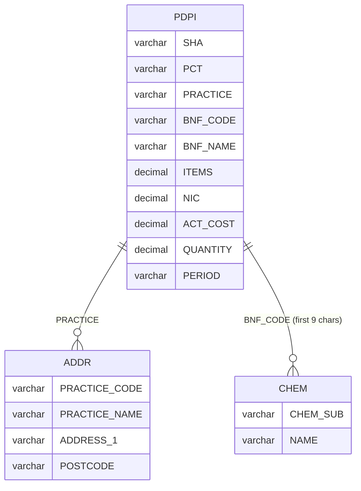

# Exasol Workshop

## Setting Up Exasol

### Deploy Exasol Personal Edition

Create a `deployment` directory inside the repo:

```bash
mkdir deployment
cd deployment
```

The `AWS_DEFAULT_REGION` is set to `eu-central-1` in the Codespace. If you're not using Codespaces, set it before running `exasol install`:

```bash
export AWS_DEFAULT_REGION=eu-central-1
```

Run the installer:

```bash
exasol install
```

Accept the EULA when prompted. The deployment takes 7-10 minutes.

All `exasol` commands must be run from within the deployment directory.

By default it deploys a single-node cluster with [`r6i.xlarge`](https://instances.vantage.sh/aws/ec2/r6i.xlarge) (4 vCPUs, 32 GB RAM, [$0.252/hour in eu-central-1](https://instances.vantage.sh/aws/ec2/r6i.xlarge)).

The `exasol install` command generates Terraform files, provisions AWS infrastructure (VPC, EC2, security groups, etc.), and installs Exasol Personal on the EC2 instance.

If the deployment process is interrupted, EC2 instances may continue to accrue costs. Check the AWS console and manually terminate any orphaned instances.

When the deployment finishes, you will see connection details for the database, the Exasol Admin URL, SSH access information, and where to find passwords.

Make sure to add these to `.gitignore`:

```gitignore
deployment/secrets-*.json
deployment/*.pem
deployment/terraform.tfstate
deployment/.terraform/
deployment/tofu
deployment/.workflowState.json
```

- `secrets-*.json` - database and admin UI passwords
- `*.pem` - private SSH key for EC2 access
- `terraform.tfstate` - Terraform state with all resource details and secrets
- `.terraform/` - Terraform provider plugins (large)
- `tofu` - OpenTofu binary (~90 MB)
- `.workflowState.json` - internal workflow tracking

### Check the status

Once the deployment finishes, check that the database is running:

```bash
exasol status
```

You should see `database_ready` in the output.

### Get connection details

```bash
exasol info
```

This shows the host, port, and password for your Exasol instance. The connection details are also saved in:

- `deployment-exasol-<id>.json` - host, port, DNS name
- `secrets-exasol-<id>.json` - database and admin UI passwords

### Connect to the database

Use the built-in SQL client:

```bash
exasol connect
```

Try a simple query:

```sql
SELECT 'Hello, Exasol!' AS greeting;
```

Type `quit` or press `Ctrl+D` to exit.

## Loading NHS Prescription Data

We will load the [Prescribing by GP Practice](https://www.data.gov.uk/dataset/176ae264-2484-4afe-a297-d51798eb8228/prescribing-by-gp-practice-presentation-level) dataset published on data.gov.uk. This dataset contains monthly prescription records from GP practices across England from 2010 to 2018 - about 10 million rows per month, over 1 billion rows total.

Each month has 3 CSV files. In data warehousing terms, they form a star schema with one fact table and two dimension tables:

- Fact table (PDPI) - the main table with measurements (items prescribed, costs). It's large (~10M rows per month) and contains foreign keys to the dimension tables.
- Dimension tables (ADDR, CHEM) - smaller lookup tables that describe the entities referenced in the fact table. They provide context: where is the practice located (ADDR), what is the chemical name for a code (CHEM).



Let's download October 2010 (the first available month) and explore each file:

```bash
mkdir data
```

### ADDR - practice addresses (dimension)

[ADDR](https://files.digital.nhs.uk/7D/F8A6AF/T201008ADDR%20BNFT.CSV) - ~10K rows per month:

```bash
wget "https://files.digital.nhs.uk/7D/F8A6AF/T201008ADDR%20BNFT.CSV" -O data/addr_201008.csv
```

Look at the first few rows:

```bash
head -5 data/addr_201008.csv
```

You'll see rows like:

```
201008,A81001,THE DENSHAM SURGERY                     ,THE HEALTH CENTRE        ,LAWSON STREET            ,STOCKTON                 ,CLEVELAND                ,TS18 1HU                 ,
```

The data is comma-separated but values are heavily padded with spaces, and there's a trailing comma at the end creating an extra empty column. There's no header row - data starts on the first line.

```bash
wc -l data/addr_201008.csv
```

About 10,263 lines.

We need to know the line endings for the `ROW SEPARATOR` when loading into Exasol. `cat -A` makes invisible characters visible: `$` marks the end of each line (the `\n`), and `^M` represents a carriage return (`\r`). So `^M$` means CRLF (`\r\n`), while a plain `$` means LF only (`\n`).

Since the lines are ~1000 bytes wide, use `tail -c 20` to see just the end:

```bash
head -1 data/addr_201008.csv | cat -A | tail -c 20
```

Output:

```
                 ^M$
```

CRLF line endings.

The columns are: PERIOD, PRACTICE_CODE, PRACTICE_NAME, ADDRESS_1, ADDRESS_2, ADDRESS_3, COUNTY, POSTCODE.

- Each row is a GP practice with its address and postcode
- The PRACTICE_CODE is the key that links to the PRACTICE field in PDPI, so we can join them to answer geographic questions (e.g. prescriptions in a specific postcode area)
- To get there we need to TRIM the space-padded values, combine the three address fields into one, and drop the extra empty column

### Manual loading

Let's load this first month manually with SQL to understand the process, then we'll automate it with Python.

Connect to the database and create a schema:

```bash
exasol connect
```

Create a staging schema. We call it "staging" because this is where we load the raw data before cleaning it up and moving it to the final tables:

```sql
CREATE SCHEMA IF NOT EXISTS PRESCRIPTIONS_UK_STAGING;
OPEN SCHEMA PRESCRIPTIONS_UK_STAGING;
```

First, we need a table to hold the raw data. The column definitions must match the CSV exactly - including the extra empty column from the trailing comma:

```sql
CREATE TABLE STG_RAW_ADDR_201008 (
    PERIOD VARCHAR(100),
    PRACTICE_CODE VARCHAR(100),
    PRACTICE_NAME VARCHAR(2000),
    ADDRESS_1 VARCHAR(2000),
    ADDRESS_2 VARCHAR(2000),
    ADDRESS_3 VARCHAR(2000),
    COUNTY VARCHAR(2000),
    POSTCODE VARCHAR(200),
    EXTRA_PADDING VARCHAR(2000)
);
```

We use wide VARCHARs because the values are space-padded, and if the column is too narrow, the database will reject the import.

The `exasol connect` terminal treats newlines as Enter, so multi-line SQL doesn't paste well. Here's the same statement as a single line you can copy-paste into the terminal (later we'll switch to Python where this won't be an issue):

```sql
CREATE TABLE STG_RAW_ADDR_201008 (PERIOD VARCHAR(100), PRACTICE_CODE VARCHAR(100), PRACTICE_NAME VARCHAR(2000), ADDRESS_1 VARCHAR(2000), ADDRESS_2 VARCHAR(2000), ADDRESS_3 VARCHAR(2000), COUNTY VARCHAR(2000), POSTCODE VARCHAR(200), EXTRA_PADDING VARCHAR(2000));
```

Now load the data. Exasol's `IMPORT FROM CSV AT` can fetch CSV files directly from HTTP URLs. The URL is split into a base (`AT`) and filename (`FILE`). We set the format based on what we found earlier - CRLF line endings and no header row (SKIP = 0):

```sql
IMPORT INTO STG_RAW_ADDR_201008
FROM CSV AT 'https://files.digital.nhs.uk/7D/F8A6AF'
FILE 'T201008ADDR%20BNFT.CSV'
COLUMN SEPARATOR = ','
ROW SEPARATOR = 'CRLF'
SKIP = 0
ENCODING = 'UTF8';
```

Single line:

```sql
IMPORT INTO STG_RAW_ADDR_201008 FROM CSV AT 'https://files.digital.nhs.uk/7D/F8A6AF' FILE 'T201008ADDR%20BNFT.CSV' COLUMN SEPARATOR = ',' ROW SEPARATOR = 'CRLF' SKIP = 0 ENCODING = 'UTF8';
```

Check how many rows were loaded:

```sql
SELECT COUNT(*) FROM STG_RAW_ADDR_201008;
```

Check a few rows:

```sql
SELECT * FROM STG_RAW_ADDR_201008 LIMIT 5;
```

The terminal truncates the columns, so it's not obvious here, but the values are still heavily padded with spaces (as we saw in the raw CSV).

We want to TRIM that padding and drop the useless EXTRA_PADDING column. This is the next step - moving the data from the raw table to a clean staging table:

```sql
CREATE TABLE STG_ADDR_201008 (
    PERIOD VARCHAR(6),
    PRACTICE_CODE VARCHAR(20),
    PRACTICE_NAME VARCHAR(200),
    ADDRESS_1 VARCHAR(200),
    ADDRESS_2 VARCHAR(200),
    ADDRESS_3 VARCHAR(200),
    COUNTY VARCHAR(200),
    POSTCODE VARCHAR(20)
);
```

Single line:

```sql
CREATE TABLE STG_ADDR_201008 (PERIOD VARCHAR(6), PRACTICE_CODE VARCHAR(20), PRACTICE_NAME VARCHAR(200), ADDRESS_1 VARCHAR(200), ADDRESS_2 VARCHAR(200), ADDRESS_3 VARCHAR(200), COUNTY VARCHAR(200), POSTCODE VARCHAR(20));
```

Insert with TRIM to strip the padding:

```sql
INSERT INTO STG_ADDR_201008
SELECT
    '201008',
    TRIM(PRACTICE_CODE),
    TRIM(PRACTICE_NAME),
    TRIM(ADDRESS_1),
    TRIM(ADDRESS_2),
    TRIM(ADDRESS_3),
    TRIM(COUNTY),
    TRIM(POSTCODE)
FROM STG_RAW_ADDR_201008;
```

Single line:

```sql
INSERT INTO STG_ADDR_201008 SELECT '201008', TRIM(PRACTICE_CODE), TRIM(PRACTICE_NAME), TRIM(ADDRESS_1), TRIM(ADDRESS_2), TRIM(ADDRESS_3), TRIM(COUNTY), TRIM(POSTCODE) FROM STG_RAW_ADDR_201008;
```

To verify the padding is gone, compare the string lengths before and after:

```sql
SELECT LENGTH(r.PRACTICE_NAME) AS raw_len, LENGTH(s.PRACTICE_NAME) AS clean_len, s.PRACTICE_NAME FROM STG_RAW_ADDR_201008 r JOIN STG_ADDR_201008 s ON TRIM(r.PRACTICE_CODE) = s.PRACTICE_CODE LIMIT 5;
```

You should see that `raw_len` is much larger than `clean_len` (e.g. 40 vs 19) - that's all the space padding we removed.

Drop the raw table:

```sql
DROP TABLE STG_RAW_ADDR_201008;
```

Verify the clean data:

```sql
SELECT * FROM STG_ADDR_201008 LIMIT 5;
```

Now we create a processed table that combines the three address fields into one and is ready for the warehouse. The original ADDRESS_1, ADDRESS_2, and ADDRESS_3 don't have a consistent meaning (sometimes ADDRESS_1 is a building name, sometimes a street number) so keeping them separate would confuse analysts. We join the non-empty parts with `, `. In Exasol, empty strings are NULL, so we use `IS NOT NULL` to check:

```sql
CREATE TABLE STG_PROCESSED_ADDR_201008 (
    PERIOD VARCHAR(6),
    PRACTICE_CODE VARCHAR(20),
    PRACTICE_NAME VARCHAR(200),
    ADDRESS VARCHAR(600),
    COUNTY VARCHAR(200),
    POSTCODE VARCHAR(20)
);
```

Single line:

```sql
CREATE TABLE STG_PROCESSED_ADDR_201008 (PERIOD VARCHAR(6), PRACTICE_CODE VARCHAR(20), PRACTICE_NAME VARCHAR(200), ADDRESS VARCHAR(600), COUNTY VARCHAR(200), POSTCODE VARCHAR(20));
```

Concatenate the address fields. Use `COALESCE` to turn NULLs into empty strings. `REPLACE` cleans up double commas from missing fields, and `TRIM` removes leftover commas from the edges:

```sql
INSERT INTO STG_PROCESSED_ADDR_201008
SELECT
    PERIOD,
    PRACTICE_CODE,
    PRACTICE_NAME,
    TRIM(BOTH ', ' FROM REPLACE(
        COALESCE(ADDRESS_1, '') || ', ' ||
        COALESCE(ADDRESS_2, '') || ', ' ||
        COALESCE(ADDRESS_3, ''),
        ', , ', ', '
    )) AS ADDRESS,
    COUNTY,
    POSTCODE
FROM STG_ADDR_201008;
```

Single line:

```sql
INSERT INTO STG_PROCESSED_ADDR_201008 SELECT PERIOD, PRACTICE_CODE, PRACTICE_NAME, TRIM(BOTH ', ' FROM REPLACE(COALESCE(ADDRESS_1, '') || ', ' || COALESCE(ADDRESS_2, '') || ', ' || COALESCE(ADDRESS_3, ''), ', , ', ', ')) AS ADDRESS, COUNTY, POSTCODE FROM STG_ADDR_201008;
```

Verify the combined address:

```sql
SELECT * FROM STG_PROCESSED_ADDR_201008 LIMIT 5;
```

### CHEM - chemical substances (dimension)

[CHEM](https://files.digital.nhs.uk/15/ED9D38/T201008CHEM%20SUBS.CSV) - ~3.5K rows per month:

```bash
wget "https://files.digital.nhs.uk/15/ED9D38/T201008CHEM%20SUBS.CSV" -O data/chem_201008.csv
```

Look at the first few rows:

```bash
head -5 data/chem_201008.csv
```

You'll see:

```
CHEM SUB ,NAME,                                                       201008,
0101010A0,Alexitol Sodium                                             ,
0101010B0,Almasilate                                                  ,
0101010C0,Aluminium Hydroxide                                         ,
0101010D0,Aluminium Hydroxide With Magnesium                          ,
```

Compare this with ADDR:

```bash
wc -l data/chem_201008.csv
```

About 3,290 lines. Check the line endings:

```bash
head -1 data/chem_201008.csv | cat -A | tail -c 20
```

Output:

```
      201008,   ^M$
```

CRLF, same as ADDR. Comparing with ADDR:

- ADDR had no header row at all, while CHEM has a header - but it's unusual: the third column contains the period value `201008` instead of a column name
- The data rows only have 2 values (code and name) plus a trailing comma
- Same space-padding as ADDR
- Same CRLF line endings as ADDR

### Loading CHEM into Exasol

CRLF line endings, has header (SKIP = 1), 3 columns:

```sql
CREATE TABLE STG_RAW_CHEM_201008 (
    CHEM_SUB VARCHAR(50),
    NAME VARCHAR(2000),
    PERIOD VARCHAR(200)
);
```

Single line:

```sql
CREATE TABLE STG_RAW_CHEM_201008 (CHEM_SUB VARCHAR(50), NAME VARCHAR(2000), PERIOD VARCHAR(200));
```

Import the data:

```sql
IMPORT INTO STG_RAW_CHEM_201008
FROM CSV AT 'https://files.digital.nhs.uk/15/ED9D38'
FILE 'T201008CHEM%20SUBS.CSV'
COLUMN SEPARATOR = ','
ROW SEPARATOR = 'CRLF'
SKIP = 1
ENCODING = 'UTF8';
```

Single line:

```sql
IMPORT INTO STG_RAW_CHEM_201008 FROM CSV AT 'https://files.digital.nhs.uk/15/ED9D38' FILE 'T201008CHEM%20SUBS.CSV' COLUMN SEPARATOR = ',' ROW SEPARATOR = 'CRLF' SKIP = 1 ENCODING = 'UTF8';
```

```sql
SELECT COUNT(*) FROM STG_RAW_CHEM_201008;
```

Check a few rows:

```sql
SELECT * FROM STG_RAW_CHEM_201008 LIMIT 5;
```

Clean up with TRIM:

```sql
CREATE TABLE STG_CHEM_201008 (
    CHEM_SUB VARCHAR(15),
    NAME VARCHAR(200),
    PERIOD VARCHAR(6)
);
```

Single line:

```sql
CREATE TABLE STG_CHEM_201008 (CHEM_SUB VARCHAR(15), NAME VARCHAR(200), PERIOD VARCHAR(6));
```

Insert with TRIM:

```sql
INSERT INTO STG_CHEM_201008
SELECT
    TRIM(CHEM_SUB),
    TRIM(NAME),
    '201008'
FROM STG_RAW_CHEM_201008;
```

Single line:

```sql
INSERT INTO STG_CHEM_201008 SELECT TRIM(CHEM_SUB), TRIM(NAME), '201008' FROM STG_RAW_CHEM_201008;
```

Drop the raw table:

```sql
DROP TABLE STG_RAW_CHEM_201008;
```

Verify the clean data:

```sql
SELECT * FROM STG_CHEM_201008 LIMIT 5;
```

### PDPI - prescriptions (fact)

[PDPI](https://files.digital.nhs.uk/B9/14BEAF/T201008PDPI%20BNFT.CSV) - ~10M rows per month.

The full file is over 1GB, so we use `curl -r` to download just the first 10KB:

```bash
curl -r 0-9999 "https://files.digital.nhs.uk/B9/14BEAF/T201008PDPI%20BNFT.CSV" -o data/pdpi_201008_sample.csv
```

Look at the first few rows:

```bash
head -5 data/pdpi_201008_sample.csv
```

You'll see:

```
 SHA,PCT,PRACTICE,BNF CODE,BNF NAME                                    ,ITEMS  ,NIC        ,ACT COST   ,QUANTITY,PERIOD,
Q30,5D7,A86003,0101010G0AAABAB,Co-Magaldrox_Susp 195mg/220mg/5ml S/F   ,0000031,00000083.79,00000078.12,0018500,201008,
Q30,5D7,A86003,0101010J0AAAAAA,Mag Trisil_Mix                          ,0000002,00000011.28,00000010.44,0002400,201008,
Q30,5D7,A86003,0101010P0AAAAAA,Co-Simalcite_Susp 125mg/500mg/5ml S/F   ,0000002,00000009.89,00000009.17,0001000,201008,
```

This is the largest file - the fact table with all prescription records.

Comparing with ADDR and CHEM:

- Has a header row (like CHEM, unlike ADDR)
- Same space-padding and trailing comma as the other files
- Additionally, numeric columns are zero-padded (e.g. `0000031`, `00000083.79`) - the other files didn't have this
- PRACTICE column links to PRACTICE_CODE in ADDR
- The first 9 characters of BNF CODE correspond to CHEM SUB in CHEM

Check the line endings:

```bash
head -1 data/pdpi_201008_sample.csv | cat -A | tail -c 20
```

Output:

```
                 ^M$
```

CRLF, same as ADDR and CHEM.

- Each row is one prescription: which practice prescribed what drug (BNF CODE/NAME), how many items, the cost (NIC = net ingredient cost, ACT COST = actual cost), and the quantity dispensed
- PRACTICE links to ADDR, the first 9 characters of BNF CODE link to CHEM SUB
- Values are padded with spaces and numbers are zero-padded (e.g. `0000031`, `00000083.79`) - Exasol handles zero-padding automatically when importing into DECIMAL columns
- There's a trailing comma after the last field, creating an extra empty column
- The file has a header row

### Loading PDPI into Exasol

CRLF line endings, has header (SKIP = 1), 11 columns (including the trailing empty one). This one takes a minute or two since it's loading ~10M rows over the network:

```sql
CREATE TABLE STG_RAW_PDPI_201008 (
    SHA VARCHAR(100),
    PCT VARCHAR(100),
    PRACTICE VARCHAR(100),
    BNF_CODE VARCHAR(50),
    BNF_NAME VARCHAR(2000),
    ITEMS DECIMAL(18,0),
    NIC DECIMAL(18,2),
    ACT_COST DECIMAL(18,2),
    QUANTITY DECIMAL(18,0),
    PERIOD VARCHAR(100),
    EXTRA_PADDING VARCHAR(2000)
);
```

Single line:

```sql
CREATE TABLE STG_RAW_PDPI_201008 (SHA VARCHAR(100), PCT VARCHAR(100), PRACTICE VARCHAR(100), BNF_CODE VARCHAR(50), BNF_NAME VARCHAR(2000), ITEMS DECIMAL(18,0), NIC DECIMAL(18,2), ACT_COST DECIMAL(18,2), QUANTITY DECIMAL(18,0), PERIOD VARCHAR(100), EXTRA_PADDING VARCHAR(2000));
```

Import the data - this takes a minute or two:

```sql
IMPORT INTO STG_RAW_PDPI_201008
FROM CSV AT 'https://files.digital.nhs.uk/B9/14BEAF'
FILE 'T201008PDPI%20BNFT.CSV'
COLUMN SEPARATOR = ','
ROW SEPARATOR = 'CRLF'
SKIP = 1
ENCODING = 'UTF8';
```

Single line:

```sql
IMPORT INTO STG_RAW_PDPI_201008 FROM CSV AT 'https://files.digital.nhs.uk/B9/14BEAF' FILE 'T201008PDPI%20BNFT.CSV' COLUMN SEPARATOR = ',' ROW SEPARATOR = 'CRLF' SKIP = 1 ENCODING = 'UTF8';
```

Check how many rows were loaded:

```sql
SELECT COUNT(*) FROM STG_RAW_PDPI_201008;
```

If the result shows scientific notation (e.g. `9.799052e+06`), use `TO_CHAR` to see the actual number:

```sql
SELECT TO_CHAR(COUNT(*)) FROM STG_RAW_PDPI_201008;
```

Check a few rows:

```sql
SELECT * FROM STG_RAW_PDPI_201008 LIMIT 5;
```

Clean up with TRIM:

```sql
CREATE TABLE STG_PDPI_201008 (
    SHA VARCHAR(10),
    PCT VARCHAR(10),
    PRACTICE VARCHAR(20),
    BNF_CODE VARCHAR(15),
    BNF_NAME VARCHAR(200),
    ITEMS DECIMAL(18,0),
    NIC DECIMAL(18,2),
    ACT_COST DECIMAL(18,2),
    QUANTITY DECIMAL(18,0),
    PERIOD VARCHAR(6)
);
```

Single line:

```sql
CREATE TABLE STG_PDPI_201008 (SHA VARCHAR(10), PCT VARCHAR(10), PRACTICE VARCHAR(20), BNF_CODE VARCHAR(15), BNF_NAME VARCHAR(200), ITEMS DECIMAL(18,0), NIC DECIMAL(18,2), ACT_COST DECIMAL(18,2), QUANTITY DECIMAL(18,0), PERIOD VARCHAR(6));
```

Insert with TRIM:

```sql
INSERT INTO STG_PDPI_201008
SELECT
    TRIM(SHA),
    TRIM(PCT),
    TRIM(PRACTICE),
    TRIM(BNF_CODE),
    TRIM(BNF_NAME),
    ITEMS,
    NIC,
    ACT_COST,
    QUANTITY,
    '201008'
FROM STG_RAW_PDPI_201008;
```

Single line:

```sql
INSERT INTO STG_PDPI_201008 SELECT TRIM(SHA), TRIM(PCT), TRIM(PRACTICE), TRIM(BNF_CODE), TRIM(BNF_NAME), ITEMS, NIC, ACT_COST, QUANTITY, '201008' FROM STG_RAW_PDPI_201008;
```

Drop the raw table:

```sql
DROP TABLE STG_RAW_PDPI_201008;
```

Verify the clean data:

```sql
SELECT * FROM STG_PDPI_201008 LIMIT 5;
```

## Manual data warehouse load

Now that we have clean staging tables, let's create the final data warehouse tables that analysts will actually query. We put them in a separate schema `PRESCRIPTIONS_UK` so analysts get a clean namespace with only the tables they need, without the staging clutter.

We want the load to be idempotent - safe to re-run at any time without duplicating data. When we later automate this with a workflow orchestrator, any step should be safely retryable.

The approach differs between facts and dimensions:

- The fact table (PRESCRIPTION) uses DELETE + INSERT per period. We first delete any existing rows for that month, then insert from staging. This prevents duplicating millions of rows on a re-run. The DELETE is a no-op on the first run.
- Dimension tables (PRACTICE, CHEMICAL) keep one row per entity. We use MERGE to insert new entities and update existing ones when the incoming period is newer. The PERIOD column tracks when each row was last updated - not a snapshot, just "this is the most recent data we have for this entity". We don't know yet whether dimensions actually change between months (e.g. does a practice move to a new address?) - we need to load all the data and analyze it first.

```sql
CREATE SCHEMA IF NOT EXISTS PRESCRIPTIONS_UK;
```

The PRACTICE dimension table maps directly from the clean staging data. The address concatenation was already done in the staging step, so the MERGE is straightforward:

```sql
CREATE TABLE IF NOT EXISTS PRESCRIPTIONS_UK.PRACTICE (
    PRACTICE_CODE VARCHAR(20),
    PRACTICE_NAME VARCHAR(200),
    ADDRESS VARCHAR(600),
    COUNTY VARCHAR(200),
    POSTCODE VARCHAR(20),
    PERIOD VARCHAR(6)
);
```

Single line:

```sql
CREATE TABLE IF NOT EXISTS PRESCRIPTIONS_UK.PRACTICE (PRACTICE_CODE VARCHAR(20), PRACTICE_NAME VARCHAR(200), ADDRESS VARCHAR(600), COUNTY VARCHAR(200), POSTCODE VARCHAR(20), PERIOD VARCHAR(6));
```

MERGE inserts new practices and updates existing ones. The PERIOD column tracks which month the data came from. Exasol doesn't support conditions on WHEN MATCHED, so we use CASE in the SET clause to only overwrite when the incoming period is newer or equal - otherwise the existing values are kept:

```sql
MERGE INTO PRESCRIPTIONS_UK.PRACTICE tgt
USING PRESCRIPTIONS_UK_STAGING.STG_PROCESSED_ADDR_201008 src
  ON tgt.PRACTICE_CODE = src.PRACTICE_CODE

WHEN MATCHED THEN UPDATE SET
    tgt.PRACTICE_NAME =
        CASE WHEN src.PERIOD >= tgt.PERIOD
             THEN src.PRACTICE_NAME ELSE tgt.PRACTICE_NAME END,
    tgt.ADDRESS =
        CASE WHEN src.PERIOD >= tgt.PERIOD
             THEN src.ADDRESS ELSE tgt.ADDRESS END,
    tgt.COUNTY =
        CASE WHEN src.PERIOD >= tgt.PERIOD
             THEN src.COUNTY ELSE tgt.COUNTY END,
    tgt.POSTCODE =
        CASE WHEN src.PERIOD >= tgt.PERIOD
             THEN src.POSTCODE ELSE tgt.POSTCODE END,
    tgt.PERIOD =
        CASE WHEN src.PERIOD >= tgt.PERIOD
             THEN src.PERIOD ELSE tgt.PERIOD END

WHEN NOT MATCHED THEN INSERT VALUES (
    src.PRACTICE_CODE, src.PRACTICE_NAME, src.ADDRESS,
    src.COUNTY, src.POSTCODE, src.PERIOD
);
```

Single line:

```sql
MERGE INTO PRESCRIPTIONS_UK.PRACTICE tgt USING PRESCRIPTIONS_UK_STAGING.STG_PROCESSED_ADDR_201008 src ON tgt.PRACTICE_CODE = src.PRACTICE_CODE WHEN MATCHED THEN UPDATE SET tgt.PRACTICE_NAME = CASE WHEN src.PERIOD >= tgt.PERIOD THEN src.PRACTICE_NAME ELSE tgt.PRACTICE_NAME END, tgt.ADDRESS = CASE WHEN src.PERIOD >= tgt.PERIOD THEN src.ADDRESS ELSE tgt.ADDRESS END, tgt.COUNTY = CASE WHEN src.PERIOD >= tgt.PERIOD THEN src.COUNTY ELSE tgt.COUNTY END, tgt.POSTCODE = CASE WHEN src.PERIOD >= tgt.PERIOD THEN src.POSTCODE ELSE tgt.POSTCODE END, tgt.PERIOD = CASE WHEN src.PERIOD >= tgt.PERIOD THEN src.PERIOD ELSE tgt.PERIOD END WHEN NOT MATCHED THEN INSERT VALUES (src.PRACTICE_CODE, src.PRACTICE_NAME, src.ADDRESS, src.COUNTY, src.POSTCODE, src.PERIOD);
```

Check the rows the address concatenation:

```sql
SELECT * FROM PRESCRIPTIONS_UK.PRACTICE LIMIT 5;
```

The CHEMICAL dimension table is built from the CHEM staging data. We rename the cryptic CSV column names to something meaningful:

- CHEM_SUB becomes CHEMICAL_CODE
- NAME becomes CHEMICAL_NAME

```sql
CREATE TABLE IF NOT EXISTS PRESCRIPTIONS_UK.CHEMICAL (
    CHEMICAL_CODE VARCHAR(15),
    CHEMICAL_NAME VARCHAR(200),
    PERIOD VARCHAR(6)
);
```

Single line:

```sql
CREATE TABLE IF NOT EXISTS PRESCRIPTIONS_UK.CHEMICAL (CHEMICAL_CODE VARCHAR(15), CHEMICAL_NAME VARCHAR(200), PERIOD VARCHAR(6));
```

Same MERGE pattern - insert new chemicals, update existing ones if the period is newer:

```sql
MERGE INTO PRESCRIPTIONS_UK.CHEMICAL tgt
USING (
    SELECT CHEM_SUB, NAME, PERIOD
    FROM PRESCRIPTIONS_UK_STAGING.STG_CHEM_201008
) src
  ON tgt.CHEMICAL_CODE = src.CHEM_SUB

WHEN MATCHED THEN UPDATE SET
    tgt.CHEMICAL_NAME =
        CASE WHEN src.PERIOD >= tgt.PERIOD
             THEN src.NAME ELSE tgt.CHEMICAL_NAME END,
    tgt.PERIOD =
        CASE WHEN src.PERIOD >= tgt.PERIOD
             THEN src.PERIOD ELSE tgt.PERIOD END

WHEN NOT MATCHED THEN INSERT VALUES (
    src.CHEM_SUB, src.NAME, src.PERIOD
);
```

Single line:

```sql
MERGE INTO PRESCRIPTIONS_UK.CHEMICAL tgt USING (SELECT CHEM_SUB, NAME, PERIOD FROM PRESCRIPTIONS_UK_STAGING.STG_CHEM_201008) src ON tgt.CHEMICAL_CODE = src.CHEM_SUB WHEN MATCHED THEN UPDATE SET tgt.CHEMICAL_NAME = CASE WHEN src.PERIOD >= tgt.PERIOD THEN src.NAME ELSE tgt.CHEMICAL_NAME END, tgt.PERIOD = CASE WHEN src.PERIOD >= tgt.PERIOD THEN src.PERIOD ELSE tgt.PERIOD END WHEN NOT MATCHED THEN INSERT VALUES (src.CHEM_SUB, src.NAME, src.PERIOD);
```

Check the result:

```sql
SELECT * FROM PRESCRIPTIONS_UK.CHEMICAL LIMIT 5;
```

The PRESCRIPTION fact table is built from the PDPI staging data. We make these changes:

- Drop SHA (Strategic Health Authority) and PCT (Primary Care Trust) - these are NHS organizational codes that aren't useful without their own lookup tables, which this dataset doesn't include. Analysts can't decode them, so they'd just add noise.
- Rename PRACTICE to PRACTICE_CODE to match the dimension table and make the join obvious
- Rename BNF_NAME to DRUG_NAME - "BNF" is NHS jargon (British National Formulary), "drug" is what analysts understand
- Rename NIC (Net Ingredient Cost) and ACT_COST (Actual Cost) to NET_COST and ACTUAL_COST for clarity
- Add CHEMICAL_CODE - extracted from the first 9 characters of BNF_CODE. A BNF code like `0212000B0AAACAC` is hierarchical: the first 9 characters (`0212000B0`) identify the chemical substance (e.g. "Atorvastatin"), while the rest identifies the specific product and formulation (e.g. "20mg tablets"). We store CHEMICAL_CODE separately so analysts can join directly to the CHEMICAL dimension table without extracting it every time

```sql
CREATE TABLE IF NOT EXISTS PRESCRIPTIONS_UK.PRESCRIPTION (
    PRACTICE_CODE VARCHAR(20),
    BNF_CODE VARCHAR(15),
    CHEMICAL_CODE VARCHAR(9),
    DRUG_NAME VARCHAR(200),
    ITEMS DECIMAL(18,0),
    NET_COST DECIMAL(18,2),
    ACTUAL_COST DECIMAL(18,2),
    QUANTITY DECIMAL(18,0),
    PERIOD VARCHAR(6)
);
```

Single line:

```sql
CREATE TABLE IF NOT EXISTS PRESCRIPTIONS_UK.PRESCRIPTION (PRACTICE_CODE VARCHAR(20), BNF_CODE VARCHAR(15), CHEMICAL_CODE VARCHAR(9), DRUG_NAME VARCHAR(200), ITEMS DECIMAL(18,0), NET_COST DECIMAL(18,2), ACTUAL_COST DECIMAL(18,2), QUANTITY DECIMAL(18,0), PERIOD VARCHAR(6));
```

Delete any existing rows for this period (no-op on first run, prevents duplicates on re-run):

```sql
DELETE FROM PRESCRIPTIONS_UK.PRESCRIPTION WHERE PERIOD = '201008';
```

Insert from staging:

```sql
INSERT INTO PRESCRIPTIONS_UK.PRESCRIPTION
SELECT
    PRACTICE,
    BNF_CODE,
    SUBSTR(BNF_CODE, 1, 9),
    BNF_NAME,
    ITEMS,
    NIC,
    ACT_COST,
    QUANTITY,
    PERIOD
FROM PRESCRIPTIONS_UK_STAGING.STG_PDPI_201008;
```

Single line:

```sql
INSERT INTO PRESCRIPTIONS_UK.PRESCRIPTION SELECT PRACTICE, BNF_CODE, SUBSTR(BNF_CODE, 1, 9), BNF_NAME, ITEMS, NIC, ACT_COST, QUANTITY, PERIOD FROM PRESCRIPTIONS_UK_STAGING.STG_PDPI_201008;
```

Check the result:

```sql
SELECT * FROM PRESCRIPTIONS_UK.PRESCRIPTION LIMIT 5;
```

This is a first draft of the warehouse design. For now we keep every monthly snapshot of each dimension, which is the safest starting point.

Once we load all 101 months, we can analyze how the data actually changes over time - do practices move? How often do chemical names change? That analysis will tell us the best way to model dimensions (e.g. slowly changing dimensions Type 1 vs Type 2, or just keeping the latest snapshot). 


## Automated data load

We loaded one month manually to understand the process. Now let's automate it - first with Python scripts, then with Kestra as a workflow orchestrator.

### Setup

```bash
mkdir -p code
cd code
uv init
uv add requests beautifulsoup4 pyexasol
```

### Find available data URLs

Set the base URL for downloading reference scripts:

```bash
PREFIX=https://raw.githubusercontent.com/alexeygrigorev/exasol-workshop-starter/main/reference
```

Download the URL scraper:

```bash
wget ${PREFIX}/find_urls.py
```

This script scrapes the [dataset page](https://www.data.gov.uk/dataset/176ae264-2484-4afe-a297-d51798eb8228/prescribing-by-gp-practice-presentation-level) to find all available CSV file URLs. Run it:

```bash
uv run python find_urls.py
```

It saves `data/prescription_urls.json` with ~101 months of data (2010-2018).

### Shared utilities module

Create the `utils/` package and download the shared modules:

```bash
mkdir -p utils
touch utils/__init__.py
wget ${PREFIX}/utils/connection_info.py -O utils/connection_info.py
wget ${PREFIX}/utils/detect_format.py -O utils/detect_format.py
wget ${PREFIX}/utils/db.py -O utils/db.py
```

- [`utils/connection_info.py`](reference/utils/connection_info.py) reads the deployment files to get host, port, and credentials
- [`utils/detect_format.py`](reference/utils/detect_format.py) detects CSV format (row separator, column count, header) by downloading a small sample
- [`utils/db.py`](reference/utils/db.py) ties them together and provides `connect()`, `ensure_schemas()`, `import_csv()`, and `get_url()` for the loader scripts

### Load ADDR (practice addresses)

```bash
wget ${PREFIX}/load_addr.py
```

This automates the same pipeline we did manually: STG_RAW → STG (trim) → STG_PROCESSED (address concat) → MERGE into PRACTICE. Run it:

```bash
uv run python load_addr.py --period 201008
```

### Load CHEM (chemical substances)

```bash
wget ${PREFIX}/load_chem.py
```

Same pattern as ADDR: STG_RAW → STG (trim) → MERGE into CHEMICAL. Run it:

```bash
uv run python load_chem.py --period 201008
```

### Load PDPI (prescriptions)

```bash
wget ${PREFIX}/load_pdpi.py
```

This is the big one (~10M rows). Pipeline: STG_RAW → STG (trim) → DELETE + INSERT into PRESCRIPTION. Run it:

```bash
uv run python load_pdpi.py --period 201008
```

### Verify the data

Download the analytics check script:

```bash
wget ${PREFIX}/check.py
```

This queries the warehouse to verify everything loaded correctly: row counts for all three tables, top 10 drugs by total cost, and top 10 practices by prescription volume. Run it:

```bash
uv run python check.py
```

This queries the warehouse to verify everything loaded correctly:

- Row counts for all three tables
- Top 10 drugs by total cost (joins PRESCRIPTION with CHEMICAL)
- Top 10 practices by prescription volume (joins PRESCRIPTION with PRACTICE)

You should see output like:

```
=== Row counts ===
  PRACTICE: 10,263 rows
  CHEMICAL: 3,289 rows
  PRESCRIPTION: 9,799,052 rows

=== Top 10 drugs by total cost ===
  BNF_CODE         CHEMICAL                                      ITEMS         COST
  ---------------- ---------------------------------------- ---------- ------------
  0212000B0AAACAC  Atorvastatin                                314,765 8,754,221.07
  ...
```

### Load another month

Each script takes `--period` so you can load any month:

```bash
uv run python load_addr.py --period 201009
uv run python load_chem.py --period 201009
uv run python load_pdpi.py --period 201009
```

All scripts are idempotent - safe to re-run. Dimensions use MERGE (only overwrites with newer data), facts use DELETE + INSERT (replaces that month's data).

Run `check.py` again to see the updated totals after loading more months.

## Orchestrating with Kestra

We have Python scripts that load one month at a time, but there are 101 months to load. Running them manually one by one isn't practical. We need a workflow orchestrator - a tool that runs tasks in the right order, handles failures, and lets us monitor progress.

[Kestra](https://kestra.io/) is an open-source orchestration platform. Workflows are defined in YAML, executed via a web UI, and each run is tracked with logs and status. To learn more about Kestra, check out the [workflow orchestration module](https://github.com/DataTalksClub/data-engineering-zoomcamp/tree/main/02-workflow-orchestration) of the Data Engineering Zoomcamp.

### Start Kestra

The [docker-compose file](reference/kestra/docker-compose.yml) mounts the project root into the Kestra container at `/workspace`, so both `code/` and `deployment/` are available. Download it:

```bash
cd code
mkdir -p kestra
wget ${PREFIX}/kestra/docker-compose.yml -O kestra/docker-compose.yml
```

Kestra runs as root inside the container. To avoid permission issues with the `.venv` directory it creates, initialize it first:

```bash
uv sync
```

Now start Kestra:

```bash
cd kestra
docker compose up -d
```

Wait a minute for it to start, then open the Kestra UI at http://localhost:8080. Log in with `admin@kestra.io` / `Admin1234!`.

### Your first flow

Let's start simple to see how Kestra works. In the Kestra UI, go to Flows, click Create. Paste the following:

```yaml
id: hello
namespace: prescriptions

tasks:
  - id: install_deps
    type: io.kestra.plugin.scripts.shell.Commands
    taskRunner:
      type: io.kestra.plugin.core.runner.Process
    commands:
      - cd /workspace/code && uv sync

  - id: find_urls
    type: io.kestra.plugin.scripts.python.Commands
    taskRunner:
      type: io.kestra.plugin.core.runner.Process
    commands:
      - cd /workspace/code && uv run python find_urls.py
```

Click Save, then Execute. You'll see two tasks run sequentially: first `install_deps`, then `find_urls`. Click on each task to see its logs.

We use `taskRunner: Process` so the scripts run directly on the host - this gives them access to both `code/` and `deployment/` directories, which are mounted into the container at `/workspace` via docker-compose.

Now try adding a third task yourself - run `load_addr.py` for period `201008`:

```yaml
  - id: load_addr
    type: io.kestra.plugin.scripts.python.Commands
    taskRunner:
      type: io.kestra.plugin.core.runner.Process
    commands:
      - cd /workspace/code && uv run python load_addr.py --period 201008
```

Save and Execute. You should see all three tasks complete.

### Load a single month

We already loaded one month manually. Now let's create a proper flow for it. Each loader script supports a `--step` argument that runs a single stage of the pipeline, so every stage (ingest raw CSV, trim whitespace, transform, warehouse load) becomes a separate step in the Kestra flow - visible in the UI with its own logs and status.

Download the flow definitions:

```bash
wget ${PREFIX}/kestra/load_addr.yml -O kestra/load_addr.yml
wget ${PREFIX}/kestra/load_chem.yml -O kestra/load_chem.yml
wget ${PREFIX}/kestra/load_pdpi.yml -O kestra/load_pdpi.yml
wget ${PREFIX}/kestra/load_month.yml -O kestra/load_month.yml
```

Each pipeline type has its own flow definition: [load_addr.yml](reference/kestra/load_addr.yml), [load_chem.yml](reference/kestra/load_chem.yml), and [load_pdpi.yml](reference/kestra/load_pdpi.yml). The [load_month.yml](reference/kestra/load_month.yml) flow calls them as subflows sequentially:

```
load_month(period)
  ├─ load_addr(period)  →  load_raw → trim → combine_address → merge
  ├─ load_chem(period)  →  load_raw → trim → merge
  └─ load_pdpi(period)  →  load_raw → trim → insert
```

Tasks in a Kestra `tasks` list run sequentially - each task waits for the previous one to finish. Each subflow has `allowFailure: true` so if one pipeline fails (e.g. a source URL is down), the others still run. Each also has `retry` configured — on failure, Kestra retries up to 3 times with a 10-second pause (`PT10S` — ISO 8601 duration format, where `PT` means "period of time", e.g. `PT1M` = 1 minute, `PT10S` = 10 seconds).

Note that `load_month` does not include `install_deps` or `find_urls` — those are run once by `load_all` before iterating over months.

Via the UI: go to Flows, click Create, paste the content of `load_month.yml`, click Save. Then click Execute, enter `201008` as the period, and click Execute.

Via the API:

```bash
# Create the flow
curl -u "admin@kestra.io:Admin1234!" \
  -X POST http://localhost:8080/api/v1/flows \
  -H "Content-Type: application/x-yaml" \
  --data-binary @kestra/load_month.yml

# Execute it
curl -u "admin@kestra.io:Admin1234!" \
  -X POST http://localhost:8080/api/v1/executions/prescriptions/load_month \
  -H "Content-Type: multipart/form-data" \
  -F "period=201008"
```

### Load all months

Download the flow:

```bash
wget ${PREFIX}/kestra/load_all.yml -O kestra/load_all.yml
```

The [load_all.yml](reference/kestra/load_all.yml) flow reuses `load_month` via `Subflow` — no need to duplicate the pipeline steps:

1. Installs dependencies and finds all available URLs
2. Uses the Kestra Python library to extract the list of 101 periods
3. ForEach iterates over all periods, calling `load_month` as a subflow for each one
4. After all months are loaded, runs `check.py` to verify the final state

Via the UI: go to Flows, click Create, paste the content of `load_all.yml`, click Save, then Execute.

Via the API:

```bash
# Create the flow
curl -u "admin@kestra.io:Admin1234!" \
  -X POST http://localhost:8080/api/v1/flows \
  -H "Content-Type: application/x-yaml" \
  --data-binary @kestra/load_all.yml

# Execute it
curl -u "admin@kestra.io:Admin1234!" \
  -X POST http://localhost:8080/api/v1/executions/prescriptions/load_all
```

Loading all 101 months takes about 30 minutes with 4 concurrent threads. You can monitor progress in the UI - each month shows as a separate iteration in the ForEach task, and each stage within that iteration is a separate step with its own logs.

Why `concurrencyLimit: 4`? The Exasol Community Edition allows only 5 parallel connections. Each month runs its pipelines sequentially (one connection at a time), so 4 concurrent months use 4 connections — safely within the limit.

Some months may fail due to unavailable source URLs (a few older months link to servers that are no longer online). The flow continues past failures — you'll see failed months marked in the UI, but the rest will keep loading. Since all our scripts are idempotent, you can re-run the flow safely. Already-loaded months will be overwritten with identical data.


## Managing the cluster

### Stopping and resuming

Stop the instance when you're not using it (to save costs):

```bash
exasol stop
```

Resume later:

```bash
exasol start
```

Note that the IPs change after restart

### Destroying the deployment

When you're completely done with the workshop:

```bash
exasol destroy
```

This terminates the EC2 instance and cleans up all AWS resources.


## Troubleshooting

- Codespace created before setting the secret? Rebuild it: `Cmd/Ctrl+Shift+P` -> "Rebuild Container"
- "Wrong passphrase"? Double-check with your instructor
- Permission errors on AWS? Ask your instructor -- the role may need updated permissions
- `exasol install` fails? Make sure `aws sts get-caller-identity` works first
- Lock file error? Remove `~/deployment/.exasolLock.json` and retry
